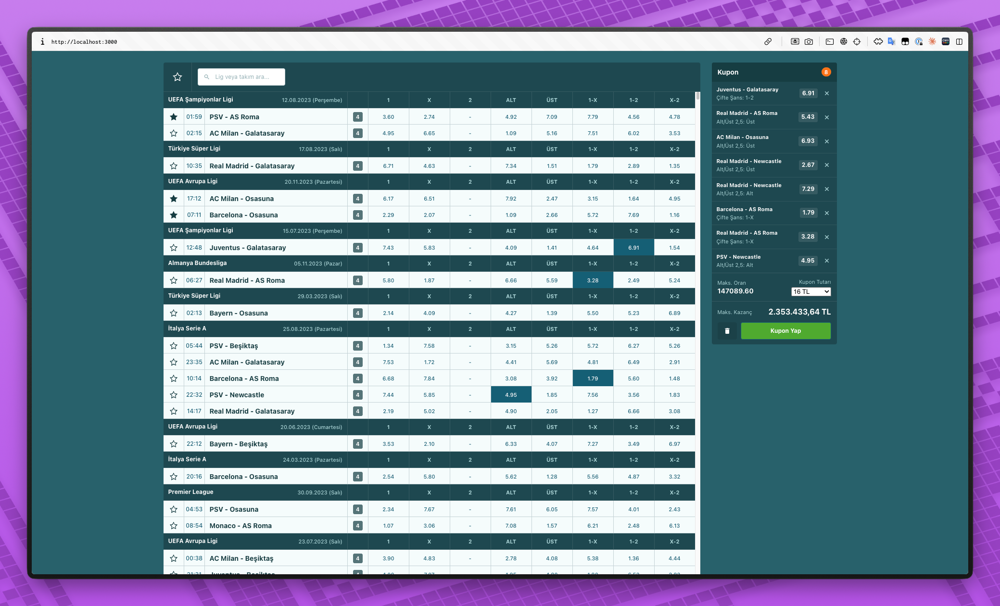
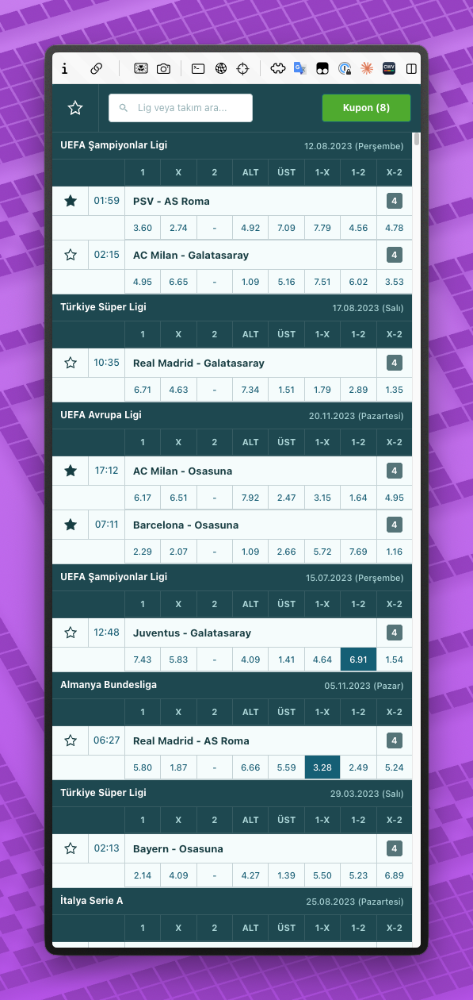
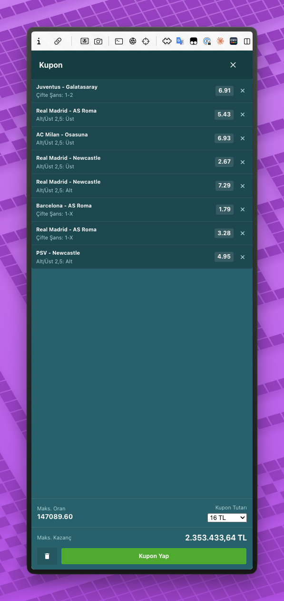

# Nesine Case Study

İddaa bülten ekranı ve kupon oluşturma uygulaması. ~3000 maçı tek sayfada performanslı şekilde listeler, oran seçimi ile kupon oluşturmayı sağlar. UI tasarımı nesine.com'a uygun şekilde ayarlanmıştır. Mobil cihazlarda da benzer deneyimi yaşatabilmek adına responsive şekilde geliştirilmiştir.

**Demo:** <!-- GitHub Pages URL'i deploy sonrası eklenecek -->

| Masaüstü | Mobil | Mobil Kupon |
|:---:|:---:|:---:|
|  |  |  |

## Kurulum

Node.js **≥18.12** gereklidir. Projede `.nvmrc` var, nvm kullanıyorsanız:

```bash
nvm use # .nvmrc'den Node 22'yi yükler
pnpm install
pnpm start # localhost:3000
pnpm build # Production build → dist/

pnpm format # Prettier
pnpm lint # ESLint
pnpm typecheck # TypeScript kontrolü
```

## Proje Yapısı

```
src/
├── app/
│   ├── index.tsx              # Entry point, provider'lar, web-vitals
│   ├── App.tsx                # Ana uygulama, veri pipeline'ı
│   └── Layout/                # Sayfa iskeleti (header, main, sidebar)
│
├── features/
│   ├── bets/
│   │   ├── components/
│   │   │   ├── BetBoard/      # react-window ile virtualized liste
│   │   │   ├── BetRow/        # Tek maç satırı
│   │   │   ├── OddCell/       # Oran hücresi (tıklanabilir)
│   │   │   ├── LeagueHeader/  # Lig başlık satırı
│   │   │   └── SearchBar/     # Arama + favori filtre
│   │   ├── store/
│   │   │   ├── betsSlice.ts   # Redux: bülten verisi
│   │   │   └── favoritesSlice.ts  # Redux: favori maçlar
│   │   ├── utils/             # filter, group, sort, flatList
│   │   ├── config/columns.ts  # Bülten sütun tanımları
│   │   └── types.ts
│   │
│   └── cart/
│       ├── components/
│       │   ├── CartPanel/     # Kupon paneli
│       │   └── CartItem/      # Tekil kupon satırı
│       ├── context/           # Context API: sepet state'i
│       └── utils/             # Tutar listesi üretici
│
├── components/atoms/          # Button, Input, Badge, Icon, Spinner
├── hooks/                     # useDebounce, useMediaQuery
├── store/                     # Redux store konfigürasyonu
├── styles/                    # Global SCSS, değişkenler, mixins
└── utils/                     # Intl.NumberFormat formatlama
```

## Teknik Kararlar

### Neden hem Redux hem Context API?

Projede iki farklı state yapısı var, bunlar;

**Bülten verisi: Redux Toolkit**

~3000 maç kaydı, read-heavy bir yapı. Veri bir kere yükleniyor ve sonra sürekli okunuyor (filtre, arama, gruplama). `createEntityAdapter` ile normalize ediliyor, böylece `selectBetById(state, id)` ile O(1) erişim sağlanıyor. Favoriler de Redux'ta çünkü bülten verisine bağlı ve `selectIsFavorite` selector'ı ile her satırda kullanılıyor.

**Kupon (Cart): Context API + useReducer**

Kupon verisi write-heavy ve küçük (maks. 20-30 seçim). Kullanıcı sürekli oran ekleyip çıkarıyor. Bunun için Redux'un middleware zincirinden geçmesine gerek yok, `useReducer` yeterli. Ayrıca kupon mantığı (aynı maçtan tek oran seçimi, MBS kuralı) kendi context'inde izole kalıyor.

Favoriler ve Kupon verisi `localStorage`'a persist ediliyor.

### Veri İşleme Pipeline'ı

API'den gelen ham veri şu sırayla işleniyor:

```
API → Redux Store → filter (favori/arama) → groupByLeague → buildFlatList → react-window
```

Her adım `useMemo` ile sarılı. Arama inputu `useDebounce(300ms)` ile throttle ediliyor, 3000 kaydı her tuşta filtrelemiyor.

`buildFlatList` fonksiyonu gruplanmış lig verilerini düz bir array'e çeviriyor. Her eleman ya `league-header` ya da `match` tipinde. react-window bu düz listeyi render ederken `RowRenderer` içinde tipe göre doğru component'i seçiyor.

### Performans Yaklaşımı

**Performans Raporu:** [PERFORMANCE.md](PERFORMANCE.md)

Hedef eski cihazlarda sorunsuz çalışma olduğu için render maliyetlerini minimumda tutmak gerekiyordu:

**Virtualization:** ~3000 satır DOM'a basılmıyor. `react-window` ile ekranda sadece görünür satırlar (~25 adet) render ediliyor. DOM node sayısı sabit kalıyor (~700).

**Memoization:** `BetRow`, `OddCell`, `CartPanel`, `SearchBar` gibi sık render olan component'ler `React.memo` ile sarılı. `useCallback` ile callback referansları stabilize ediliyor.

**CLS = 0:** Loading, error ve success state'lerinde toolbar ve sidebar her zaman aynı component'leri render ediyor. Sadece ana içerik (main slot) değişiyor. Böylece layout shift sıfır.

**Bundle optimizasyonu (production):**
- `TerserPlugin` ile minify, `console.log` temizliği
- `CssMinimizerPlugin` ile CSS minify
- `splitChunks` ile react/vendor ayrımı (cache verimliliği)
- `contenthash` ile uzun süreli cache

**Diğer:**
- `web-vitals` ile LCP, INP, CLS runtime ölçümü
- `browserslist` hedefi: `> 0.5%`, `last 2 versions`, `not dead`, `Android >= 5`, `iOS >= 10` — Babel ve autoprefixer bu listeye göre polyfill ve vendor prefix ekliyor
- API origin'e `<link rel="preconnect">` ile erken bağlantı

### Kupon Mantığı

Bir maç için tek bir oran seçimi yapılabilir:

- Yeni oran seçildiğinde → kupona eklenir
- Aynı oran tekrar tıklanırsa → kupondan çıkarılır
- Aynı maçtan farklı oran seçilirse → eski seçim güncellenir

MBS (Minimum Bahis Sayısı) kuralı: Kuponda yeterli bahis yoksa "Kupon Yap" butonu disable. 
Maks. kazanç üst limiti 12.500.000 TL.

### Responsive Tasarım

Masaüstü ve tablet (≤768px) için iki ayrı layout:

- **Masaüstü:** Sabit sidebar'da kupon paneli, ana alanda bülten
- **Tablet/Mobil:** Sidebar gizlenir, toolbar'da "Kupon (X)" butonu çıkar. Tıklandığında kupon tam ekran overlay olarak açılır. BetRow ve LeagueHeader iki satırlı grid yapısına geçer.

Responsive davranış `useMediaQuery` custom hook'u ile yönetiliyor. Satır yüksekliği masaüstünde 34px, mobilde 68px.

## Tech Stack

| Katman | Teknoloji |
|--------|-----------|
| UI | React 19 + TypeScript |
| Build | Webpack 5 + Babel 7 |
| State (bülten) | Redux Toolkit (`createEntityAdapter`) |
| State (kupon) | Context API + `useReducer` |
| Virtualization | react-window v2 |
| Stil | SCSS Modules + PostCSS (autoprefixer) |
| Lint/Format | ESLint + Prettier |
| Ölçüm | web-vitals (LCP, INP, CLS) |
